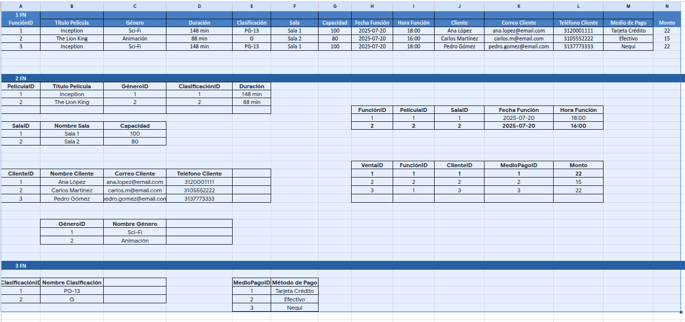
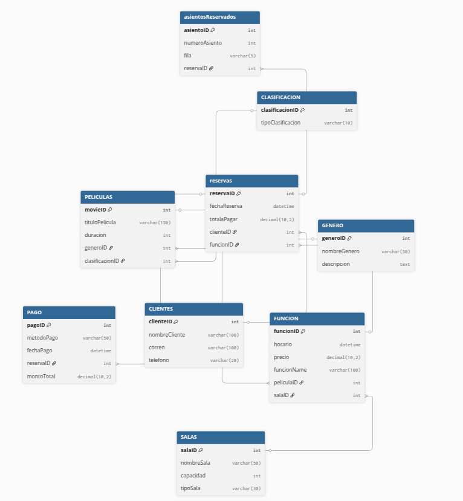

PARTE 1..............................

FORMA NORMAL #1:  Lo primero que hacemos es asegurarnos de que cada celda tenga un solo dato, dejando mas en claro que cada registro tenga su propio identificador.

FORMA NORMAL #2:  Aqui colocamos cada cosa en su lugar, empezando desde el fundamento de que cada caracteristica en cada tabla debe depender unicamente de su clave principal o ID. Asi que dividimos cada tabla entidad en su propia tabla y con sus propios atributos y caracteristicas, dejando cada tabla con su propio ID (clave-primaria).

FORMA NORMA #3:

Por ultimo, devidimos las tabla ventas, de las cuales se pueden sacar la tabla pagos y reservaciones, eliminando asi las dependencias transitivas.

PARTE 2..............................

PARTE 3..............................
UML Diagram para dbdiagram.io

classDiagram
    class CLIENTE {
        int ID_Cliente [PK]
        String Nombre
        String Correo
        String Telefono
    }
    
    class RESERVA {
        int ID_Reserva [PK]
        int ID_Funcion [FK]
        int ID_Cliente [FK]
        int ID_TipoPago [FK]
        String Asiento
        float Monto_Base
        float Monto_Total_Calculado [Derivado]
    }
    
    class FUNCION {
        int ID_Funcion [PK]
        int ID_Pelicula [FK]
        int ID_Sala [FK]
        Datetime Horario
    }
    
    class PELICULA {
        int ID_Pelicula [PK]
        int ID_Clasificacion [FK]
        int ID_Genero [FK]
        String Nombre_Pelicula
        int Duracion_Minutos
    }
    
    class SALA {
        int ID_Sala [PK]
        String Nombre_Sala
        int Capacidad_Maxima
    }
    
    class TIPO_PAGO {
        int ID_TipoPago [PK]
        String Descripcion
    }

    class CLASIFICACION {
        int ID_Clasificacion [PK]
        String Nombre_Clasificacion
    }

    class GENERO {
        int ID_Genero [PK]
        String Nombre_Genero
    }

    %% Relaciones y Cardinalidades
    CLIENTE "1" --> "0..*" RESERVA : realiza
    FUNCION "1" --> "0..*" RESERVA : incluye
    PELICULA "1" --> "0..*" FUNCION : tiene programada
    SALA "1" --> "0..*" FUNCION : agenda
    TIPO_PAGO "1" --> "0..*" RESERVA : procesa
    CLASIFICACION "1" --> "0..*" PELICULA : agrupa
    GENERO "1" --> "0..*" PELICULA : categoriza

Entidades y Atributos
<!-- Clasificación -->

ClasificacionID (PK)

TipoClasificacion

<!-- Género -->

GeneroID (PK)

Nombre

<!-- Película -->

PeliculaID (PK)

Titulo

DuracionMinutos

ClasificacionID (FK)

GeneroID (FK)

<!-- Sala -->

SalaID (PK)

Nombre

Capacidad

<!-- Función -->

FuncionID (PK)

Fecha

Hora

PeliculaID (FK)

SalaID (FK)

<!-- Cliente -->

ClienteID (PK)

Nombre

Correo

Telefono

MedioPago

MedioPagoID (PK)

Metodo (credito o debito)

<!-- Venta -->

VentaID (PK)

CantidadBoletos

PrecioUnitario

FechaVenta

/MontoTotal (Atributo derivado)

FuncionID (FK)

ClienteID (FK)

MedioPagoID (FK)

